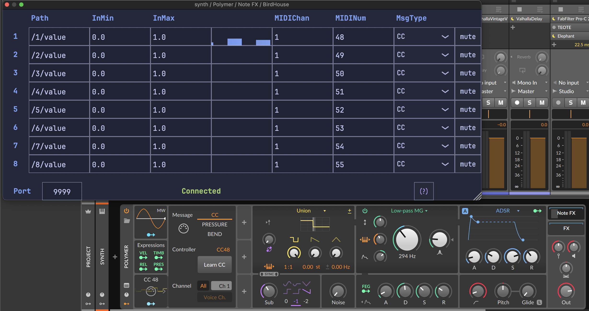

[](https://ko-fi.com/X8X6RXV10)

# BirdHouse
## An OSC to MIDI bridge

 

With BirdHouse you can send OSC messages to a DAW or plugin host and have them converted to MIDI.

The Birdhouse OSC to MIDI plugin is a simple plugin that listens for OSC messages, processes their data and sends outputs it as MIDI to allow using it in a DAW or other plugin host environment. Each instance of Birdhouse is able to process a stream of OSC messages to a MIDI event type, with a visualization of the stream and the ability to mute/unmute the output data. 

The need for this plugin arose from having to make different projects that rely on OSC communication to generate notes or affect sound parameters. Often this was solved with middlewares written in one of the common computer music languages, with varying levels of success and then passed on to different Digital Audio Workstations with even more varying levels of success. The thing is, different software process OSC messages with different priority levels. This can be annoying in interactive art since we sometimes want to blast software with values from sensors, other software or from wherever, and be able to expect pretty consistent results. Birdhouse attempts to solve this.

## Features

- Convert OSC to MIDI inside any DAW or plugin host
- Realtime-processing of the incoming OSC messages
- Audio-rate MIDI 
- Scale from any input value range to MIDI ranges automatically
- Process 8 streams of OSC messages per instance
- Output common MIDI message types: Note on/off, MIDI CC, Pitch bend (more coming)

## Use cases

- Controlling your DAW using a phone or tablet
- Sending OSC from an Arduino, ESP or Raspberry Pi Pico to a DAW to trigger notes or control parameter changes in plugins
- Using OSC to control a DAW using computer music software like SuperCollider, Max/MSP or PureData

## Supported hosts

Tested and working in:
- ✅ Reaper
- ✅ BitWig

Untested: 
- ✖️ Ableton Live
- ✖️ Logic Pro
- ✖️ Cubase
- ✖️ Pro Tools
- ✖️ FL Studio
- ✖️ Studio One
- ✖️ Reason

If you test the plugin in one of the untested or unmentioned hosts, please open an issue and let us know how it worked.

# Usage

See the [manual](manual/birdhouse-manual.pdf).

# Development

This project was generated using [Cookiejuce](github.com/madskjeldgaard/Cookiejuce).

## Building

Configure:
```bash
cmake -S . -B build
```

Build:
```bash
cmake --build build
```

The plugins are now copied to your system.

Run standalone (on MacOS):
```bash
./build/BirdHouse_artefacts/Standalone/BirdHouse.app/Contents/MacOS/BirdHouse
```

## Building the manual

The manual is built using pandoc. Run it from the root of the repo:

```bash
pandoc -i manual/birdhouse-manual.md -o manual/birdhouse-manual.pdf
```
